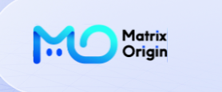

<h1 align="center">Hi, I'm Vito 👋</h1>

  🤖 AI Product Manager &nbsp;·&nbsp; 🧠 AI Power User &nbsp;·&nbsp; 🧩 AI-Native Product Builder

  🎓 Master's student at Shanghai University &nbsp;·&nbsp; 📍 Shanghai, China

## 👨‍💻 关于我 · About Me

我是一名 **AI 重度玩家**，也是持续在一线构建 AI 产品的产品经理。我不把 AI 只当作聊天工具，而是把它当作新的产品基础设施：连接数据、模型、工具、工作流与人的判断，让复杂任务真正被执行、验证和持续优化。

I'm an **AI power user** and a product manager who builds with AI every day. I see AI as more than a conversational interface—it is a new product infrastructure that connects data, models, tools, workflows, and human judgment to make complex work executable, verifiable, and continuously improvable.

我长期关注 / My areas of focus:

- 🤖 **Agent Systems** — 工具调用、状态编排、记忆、权限与人机协作 / tool use, state orchestration, memory, permissions, and human–AI collaboration
- 📚 **RAG & Knowledge** — 多模态解析、混合检索、重排、引用溯源与评估 / multimodal parsing, hybrid retrieval, reranking, citation grounding, and evaluation
- 🔎 **Deep Research** — 多智能体研究、信源治理、数据分析、写作与审核闭环 / multi-agent research, source governance, analysis, writing, and review loops
- 🧪 **AI Productization** — 结构化输出、可观测性、成本、可靠性与隐私 / structured output, observability, cost, reliability, and privacy
- 🛠️ **Developer Tools** — Coding Agents、MCP、Skills 与 AI-native workflows

## 💼 工作经历 · Experience

<table>
  <tr>
    <td width="96" align="center">
      
    </td>
    <td>
      <strong>MatrixOrigin · AI Product Manager · Present</strong>  
      围绕 <strong>MatrixOne Intelligence (MOI)</strong> 推进 AI Native 产品设计，将 AI Studio、MatrixOne 与 Genesis 串联为从多模态数据接入、加工治理和 AI-Ready 数据，到知识库、工作流、Agent 与应用构建的一体化路径。重点关注企业级 AI 从 Demo 走向生产所需要的权限、可追溯性、可观测性、模型服务治理与持续优化闭环。  
      Driving AI-native product design for <strong>MatrixOne Intelligence (MOI)</strong>, connecting AI Studio, MatrixOne, and Genesis into an integrated journey from multimodal data ingestion and governance to AI-Ready data, knowledge bases, workflows, agents, and applications. My focus is turning AI demos into production-ready systems through permissions, traceability, observability, model-service governance, and continuous improvement loops.
    </td>
  </tr>
</table>

## 🧭 我的产品观 · Product Principles

> **AI Native 不是在旧产品上增加一个聊天框，而是重新设计数据如何流动、任务如何执行、结果如何被信任。**
>
> **AI Native is not about adding a chat box to an existing product. It is about redesigning how data flows, how work gets done, and how results earn trust.**

我相信优秀的 AI 产品经理需要同时理解用户任务、模型行为与系统边界：既能定义产品价值，也能深入上下文工程、Agent 编排、评估体系和生产可靠性，把模型能力真正转化为稳定的产品能力。

I believe a strong AI product manager must understand user jobs, model behavior, and system constraints at the same time—connecting product strategy with context engineering, agent orchestration, evaluation, and production reliability.

## 🚀 正在构建 · Building

- 📘 [Claude Code Handbook](https://github.com/vitoworleone/claude-code-handbook) — 把 Claude Code 从“会用”推进到“造得出”的实战知识库
- 🧠 持续实践 Coding Agents、Deep Research、RAG、MCP 与多智能体工作流

---

  <strong>Build with AI. Think in systems. Ship what works. ✨</strong>

